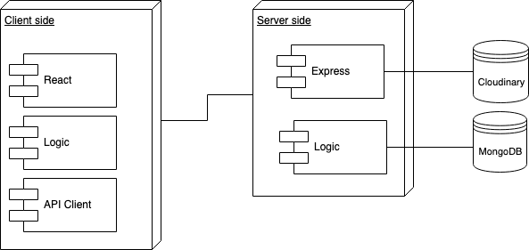
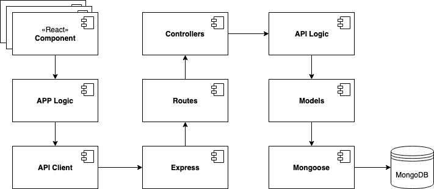

# Avarus

Avarus is a investment-game where you ,as a user, will have an initial budget to invest shares of ficitionary companies and gain profit. Once when you get into the game, you can retrieve company, see it's shares evolution, buy or sell it's shares to gain the profit, add favorite company into account, modify your personal profile and leave comments for each transaction that you have made.


## Process

** avarus-data **

```
npm i
```

** avarus-util **

```
npm i
```

** avarus-app **

```
npm i
```

```
yarn start
```

** avarus-api **

```
npm i
```

```
node .
```

```
node utils/populate.js
```

## Features

Anouymous user can: 
- Register
- Login

Register user can:
- Check/Update user's own account information such as change password or personal picture
- Retrieve company by it's id or category
- Add preferent company as favorite company
- Check favorite company lists 
- Check detail of each company including company's information, company daily share's variation
- Buy/Sell share's of company 
- Check detail of a buy-in transaction
- Leave/Update/Delete Comment for transactions

## Functional Description

### Use cases

### Flow


## Technical Description

### Blocks


### Components


### Data Model


## Code Coverage
### API


### APP


## Technologies

HTML5, CSS3, SASS, Javascript, React.js, Node.js, Express, MongoDB & Mongoose

## Credits

Hongda(Adrían) Zhu